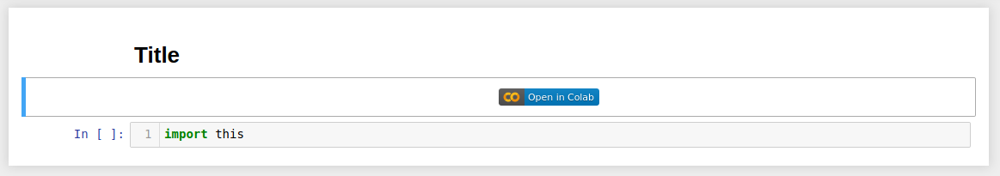
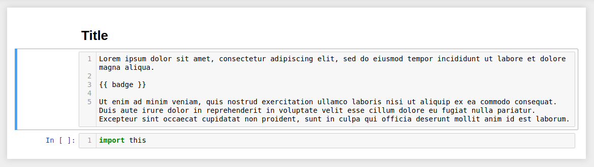
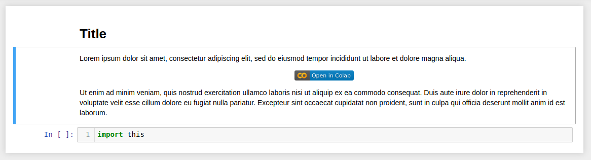

# Colab Badge GitHub Action

> Adds "Open in Colab" badges for Jupyter Notebooks, automatically updates
badges on file renaming, branching or forking.


## Usage

### Badge Tag

Inside a markdown cell add a double braces `{{ badge }}` tag to indicate the position for the badge:


Action will create a badge for you:



You can use it inside a text as well:






### Example Workflow

A workflow file for adding/updating badges for notebooks in a repo: 

```yaml
name: Example Workflow
on: [push]

jobs:
  build:
    name: Example Job
    runs-on: ubuntu-latest
    steps:
      - uses: actions/checkout@v1
      - name: Colab Badge Action 
        uses: trsvchn/colab-badge-action@v1
        with:
          github_token: ${{ secrets.GITHUB_TOKEN }}
          check: 'all'
          update: true
```

### Inputs

- `github_token` - token for the GitHub repository, can be referenced by using `${{ secrets.GITHUB_TOKEN }}`

- `check`: `'all'` - to check every notebook for the `{{ badge }}` tag and "render" into to a Colab badge. Default: `'all'`
To add/update badges only for notebooks in a current commit set to `'latest'`

- `update`: `true` - to update a badge if a piece of information relevant to it has changed. Default: `true`. With`false` inserts badges with no further updates (ignores changes)
